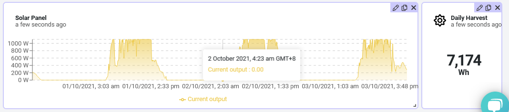

# WisBlock RAK11200 - RAK13300 SMA Sunnyboy to IoT    

| 

  | 

 | 

 | 

  |
| -- | -- | -- | -- |

----

As my solar panels were installed by [PHilERGY](https://www.philergy.com/), the engineers explained to me how to connect the SMA SunnyBoy inverter to my local WiFi network. This enables the inverter to send its production data and status over the internet to SMA's servers.    
Of course this is very comfortable, but for me as an IoT engineer, I wanted to have direct access to the inverter and collect the data by myself. Luckily, SMA has included a web interface in the Sunnyboy and released an API to request data from the inverter directly.
After some research I found the [SMA SunnyBoy Reader](https://github.com/pkoerber/SMA-SunnyBoy-Reader), which is an easy to use interface to talk directly to the SMA SunnyBoy inverter.    

This application reads solar production and total harvested energy from the [SMA Sunnyboy Inverter](https://www.sma.de/en/products/solarinverters/sunny-boy-15-20-25.html) to show the status of the solar panel energy production.
It shares the information over WiFi (UDP broadcasting) and LoRaWAN for cloud based data processing and visualization.
I choose UDP broadcasting in my local network, because it enables me to receive the data on different devices like my ESP32 based Home Control Display and my Android phones.

The result of this project can be seen in my public Datacake Dashboard [Around my House](https://app.datacake.de/dashboard/d/b6acccc0-2264-42d4-aec9-94148d7eb76f) in the Solar Panel chart.    

    

_**REMARK**_
This project is made with PlatformIO!

----

## Hardware 

The system is build with modules from the [RAKwireless WisBlock](https://docs.rakwireless.com/Product-Categories/WisBlock/) product line. 
- [WisBlock RAK5005-O](https://docs.rakwireless.com/Product-Categories/WisBlock/RAK5005-O/Overview/) Base board
- [WisBlock RAK11200](https://docs.rakwireless.com/Product-Categories/WisBlock/RAK11200/Overview/) Core module to connect to the SMA Sunnyboy inverter and for the UDP broadcasting.
- [WisBlock RAK13300](https://docs.rakwireless.com/Product-Categories/WisBlock/RAK13300/Overview) SX1262 LoRa module for LoRaWAN transmissions

----

## Software
The software on the RAK11200 handles the communication over WiFi to read data from the SMA Sunnyboy inverter, broadcasts the values over WiFi UDP and sends the data as well to a LoRaWAN server using the RAK13300 LoRa module

### IDE, BSP's and libraries:
- [PlatformIO](https://platformio.org/install)
- [Espressif ESP32 BSP](https://docs.platformio.org/en/latest/boards/index.html#espressif-32)
- [Patch to use RAK11200 with PlatformIO](https://github.com/RAKWireless/WisBlock/tree/master/PlatformIO/RAK11200)
- [SX126x-Arduino LoRaWAN library](https://github.com/beegee-tokyo/SX126x-Arduino)
- [ArduinoJson](https://github.com/bblanchon/ArduinoJson.git)
- [SMA SunnyBoy Reader](https://github.com/pkoerber/SMA-SunnyBoy-Reader)
- [ESP32 Application Log](https://github.com/beegee-tokyo/ESP32-MyLog)
- [NimBLE-Arduino](https://github.com/h2zero/NimBLE-Arduino)

----

# Setting up WiFi credentials
The application uses MultiWiFi class to search for up to two WiFi networks and connect to the one with the better signal quality.
The two WiFi networks can be hard-coded in [src/prefs.cpp](./src/prefs.cpp).
But the suggested solution is to setup the WiFi credentials with the [WisBlock Toolbox](https://play.google.com/store/apps/details?id=tk.giesecke.wisblock_toolbox) over BLE

----

# Setting up LoRaWAN credentials
The LoRaWAN credentials are hard-coded in [src/main.h](./src/main.h). But it is suggested to use other methods to change the LoRaWAN credentials. The firmware offers two options, BLE or AT commands over the USB port:

## 1) Setup over BLE
Using the [WisBlock Toolbox](https://play.google.com/store/apps/details?id=tk.giesecke.wisblock_toolbox) you can connect to the WisBlock over BLE and setup all LoRaWAN parameters like
- Region
- OTAA/ABP
- Confirmed/Unconfirmed message
- ...

More details can be found in the [WisBlock Toolbox](https://github.com/beegee-tokyo/WisBlock-Toolbox)

## 2) Setup over USB port
Using the AT command interface the WisBlock can be setup over the USB port.

A detailed manual for the AT commands are in [AT-Commands.md](./AT-Commands.md)

----

# Setting up SMA Sunnyboy IP address and connection credentials
This is a _**TODO**_. Right now the IP address and password of the SMA Sunnyboy inverter are hard-coded in the [main.cpp](./MHC-Sunnyboy-RAK13300/src/main.cpp). Because the data set used to setup the WiFi credentials is not flexible, I cannot use it for additional details. 
The plan is to implement the setup of the SMA Sunnyboy IP address and password over BLE UART.

----

# Special thanks

Special thanks to @h2zero for his outstanding work on the [NimBLE-Arduino](https://github.com/h2zero/NimBLE-Arduino) for the ESP32, that uses only a fraction of memory compared with the BLE library coming with ESP32 Arduino BSP.

Special thanks to @pkoerber for his [SMA SunnyBoy Reader](https://github.com/pkoerber/SMA-SunnyBoy-Reader) that made it so simple to communicate with the SMA Sunnyboy Inverters.